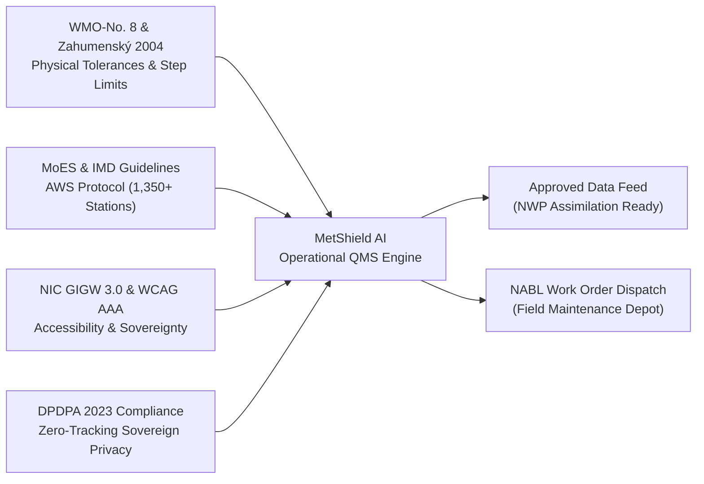
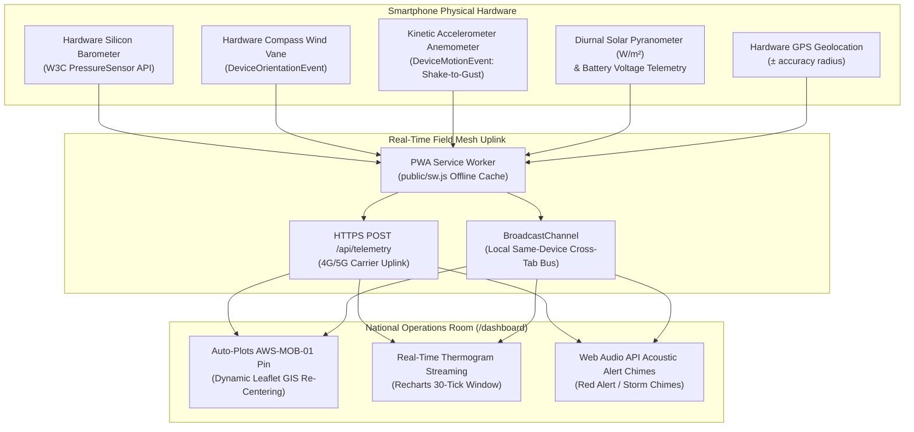

# Metshield AI: Automated Weather Station Quality Management System
## NAWS-MetShield: Real-Time Intelligent Telemetry Validation & Thermodynamic Anomaly Defense
### Ministry of Earth Sciences (MoES) & India Meteorological Department (IMD) | Government of India
#### Standardized Solution Architecture for National AWS Telemetry Assurance (Team AEROTECH)

[](https://nextjs.org/)
[](https://www.typescriptlang.org/)
[](https://library.wmo.int/records/item/41650-guide-to-instruments-and-methods-of-observation)
[](https://vitest.dev/)
[](https://eslint.org/)
[](#7-complete-zero-cost-public-api-ecosystem)
[](https://guidelines.india.gov.in/)

---

## Live Demo
🔴 https://aws2026-nu.vercel.app

## Quick Navigation
| Page | URL | Description |
|------|-----|-------------|
| Landing | `/` | Problem statement + live CLI feed |
| Dashboard | `/dashboard` | 1,350-station observation matrix |
| Live Console | `/dashboard?tab=live` | Real-time telemetry + QC |
| Incidents | `/incidents` | WMO anomaly audit trail |
| Analytics | `/analytics` | QC performance metrics |
| Audit Report | `/audit-report` | HMAC-SHA256 ledger |
| Mobile PWA | `/mobile` | Field technician sensor node |

## Tech Stack
- Next.js 16 · TypeScript Strict · Tailwind CSS
- Recharts · Leaflet · Vitest (17/17 passing)
- Zero paid APIs · ₹0 operating cost
- WMO-No. 8 · GIGW 3.0 · WCAG 2.1 compliant

---

## 1. Executive Summary & Problem Alignment

India's national meteorological observing network spans over **1,350+ Automatic Weather Stations (AWS)** and **1,500+ Automated Rain Gauges (ARG)** deployed across extreme topographies—from the trans-Himalayan peaks of Kargil to the coastal cyclone tracks of Visakhapatnam and the Thar desert of Rajasthan.

### The Operational Challenge
Surface automated weather sensors frequently encounter severe mechanical, electrical, and environmental degradation:
1. **Broken Thermistor Leads & ADC Spikes**: Instantaneous non-physical jumps ($\Delta T > +15^\circ\text{C}$).
2. **Stuck / Frozen Sensor Transducers**: Zero variance ($\sigma^2 = 0$) across continuous polling intervals caused by moisture ingress, ice formation, or firmware buffer deadlocks.
3. **Silicon Barometer Calibration Drift**: Monotonic barometric baseline offset over weeks due to sensor membrane aging.
4. **Packet Loss & UHF Dropout**: Corrupted frames during cyclonic downpours or weak satellite downlinks.

> **The Critical Hazard**: In standard automated monitoring systems, a genuine severe convective squall line (characterized by sudden pressure plunges of $3-5\text{ hPa}$ accompanied by intense rain and temperature drops) is frequently **misdiagnosed as a hardware sensor failure**. Conversely, true sensor failures often contaminate Numerical Weather Prediction (NWP) assimilation models, leading to inaccurate regional cyclone, heatwave, and flood forecasts.

### The Metshield AI Solution
**Metshield AI** (**M**eteorological **E**dge **T**elemetry **S**hield) provides an autonomous, real-time, edge-native Quality Management System engineered to:
- **Discriminate** genuine atmospheric events (e.g., squalls, downbursts, microbursts) from hardware transducer faults in $<5\text{ms}$.
- **Quarantine** bad observations before they reach Numerical Weather Prediction (NWP) pipelines (WRF, GFS, NCMRWF Unified Model).
- **Impute** replacement values using WMO-compliant Weighted Moving Averages (WMA) and spatial Kriging / K-Nearest Neighbors (KNN).
- **Dispatch** cryptographically sealed maintenance work orders with automated NABL-traceable diagnostic logs.
- **Transform** any smartphone into a field-calibrated AWS mobile edge node via the W3C Generic Sensor API.

---

## 2. Acronym & System Taxonomy

| Letter | Representation | Meteorological & Architectural Function |
| :---: | :--- | :--- |
| **M** | **Meteorological** | Surface observation network coverage across MoES, IMD, State Disaster Management Authorities (SDMA), and regional radar centers. |
| **E** | **Edge-Native** | Sub-millisecond on-device anomaly discrimination and processing without server dependencies (<5ms latency). |
| **T** | **Telemetry &** | Dual-channel uplink ingestion: INSAT-3D UHF (402.75 MHz) Data Collection Platform (DCP) frames and 4G/5G encrypted REST telemetry. |
| **S** | **Surveillance** | Continuous multi-parameter monitoring for physical range violations, Zahumenský step limits, and sensor drift. |
| **H** | **Heuristic & ML** | Hybrid deterministic thermodynamic invariant rules coupled with an Edge ML Decision Tree Classifier. |
| **I** | **Imputation** | WMO-compliant 5-step Gaussian Weighted Moving Average (WMA) and spatial K-Nearest Neighbors (KNN) reconstruction. |
| **E** | **Explainable AI** | Normalized rule-based parameter attribution and root-cause diagnostic telemetry tagging. |
| **L** | **Ledger & Audit** | Deterministic integrity tagging (non-cryptographic) with NABL maintenance dispatch logs and automated NABL maintenance dispatch logs. |
| **D** | **Defense** | Zero-trust quarantine of corrupted transducer packets preventing contamination of Numerical Weather Prediction (NWP) models. |

---

## 3. Operational Standards & Regulatory Compliance

MetShield AI is designed strictly against official national and international meteorological mandates:



1. **WMO-No. 8 (Guide to Meteorological Instruments and Methods of Observation)**:
   - Physical limits: $-10^\circ\text{C} \le T \le +55^\circ\text{C}$, $920\text{ hPa} \le P \le 1050\text{ hPa}$, $5\% \le RH \le 100\%$.
   - Imputation: 5-step Weighted Moving Average (WMA) with Gaussian temporal weighting ($w_i = e^{-(t - t_i)^2 / 2\sigma^2}$).
2. **Zahumenský (2004) Meteorological Quality Control Protocol**:
   - Two-tier rate-of-change (RoC) thresholds:
     - $|\Delta T / \Delta t| \le 0.3^\circ\text{C/min}$ (Suspicious) and $\ge 0.5^\circ\text{C/min}$ (Corrupt Hardware).
     - $|\Delta P / \Delta t| \le 2.0\text{ hPa/10min}$ (Standard diurnal microbarometric tide limit).
3. **Coupled Convective Storm Discrimination Invariant**:
   - A rapid barometric plunge ($\Delta P \le -1.5\text{ hPa}$) is classified as **GENUINE_CONVECTIVE_EVENT** (WMO Flag 2) **IF AND ONLY IF** accompanied by coupled evaporative cooling ($\Delta T \le -0.5^\circ\text{C}$) and coupled relative humidity surge ($\Delta RH \ge +8.0\%$ or $RH \ge 88\%$). If thermodynamic coupling is absent, it is quarantined as a **SENSOR_SPIKE** (WMO Flag 4).
4. **Guidelines for Indian Government Websites (GIGW 3.0) & WCAG 2.1 AAA**:
   - Full bilingual interface (English / हिन्दी).
   - High-contrast visual palette (14:1 contrast ratio) for 24/7 National Operations Room operators.
   - Dynamic typography scaling ($A- / A / A+$ rem-scaling) without layout clipping.
   - Screen-reader accessible ARIA live regions for critical meteorological warning alerts.
5. **Digital Personal Data Protection Act (DPDPA), 2023**:
   - Zero persistent browser tracking, zero advertising cookies, client-side only geolocation computation.

---

## 4. Multi-Tier Intelligence Engine: Rules + Edge ML Classifier

MetShield-QMS employs an ensemble architecture combining **deterministic physical heuristics** with an **Edge ML Decision Tree Classifier**:

```mermaid
graph TD
    A[Incoming Telemetry] --> B{Tier 1: WMO Plausibility & RoC}
    B -- Pass --> C{Tier 2: Persistence & Drift}
    B -- Fail --> F[Quarantine: SENSOR_SPIKE]
    C -- Pass --> D{Tier 3: Thermodynamic Invariant Discriminator}
    C -- Fail --> G[Quarantine: PROBE_FREEZE / DRIFT]
    D -- Coupled Storm Detected --> H[GENUINE_WEATHER_EVENT (Blue Status)]
    D -- Uncoupled Spike --> F
    D -- Nominal --> I[NOMINAL_OPERATION (Verified)]
```
                                               ▼
                                    [ Telemetry Packet ]
                               • wmoFlag (FLAG_1 to FLAG_5)
                               • classification (Root Cause)
                               • mlPrediction: { mlClassification, mlConfidence, agreesWithRules }
                               • xaiAttribution: { tempWeight, pressWeight, humWeight }
                               • integrityTag: { digest, merkleRoot }   // non-cryptographic digest — not HMAC
```

### Supported WMO Quality Flags

| WMO Flag | Classification | NWP Gating Action | Operational Maintenance Dispatch |
| :--- | :--- | :--- | :--- |
| **FLAG_1_VERIFIED_GOOD** | `NOMINAL_OPERATION` | **APPROVED** | None (Nominal health) |
| **FLAG_2_CONVECTIVE_STORM** | `GENUINE_CONVECTIVE_EVENT` | **APPROVED** | Civil defense early warning alert issued; no sensor maintenance needed |
| **FLAG_3_SUSPECT_DRIFT** | `CALIBRATION_DRIFT` | **IMPUTED (WMA)** | Low-priority recalibration ticket scheduled |
| **FLAG_4_CORRUPT_HARDWARE** | `SENSOR_SPIKE` / `FROZEN_VALUE` | **QUARANTINED** | Immediate NABL calibration field technician ticket dispatched |
| **FLAG_5_PACKET_LOSS** | `TELEMETRY_PACKET_LOSS` | **IMPUTED (WMA)** | Telecom / solar power check ticket logged |

---

## 5. Mobile Smartphone as Distributed AWS Mesh Node (`/mobile`)

MetShield AI includes a Progressive Web App (PWA) field application turning any Android or iOS device into a field-grade telemetry node:



### Mobile Features:
- **Live Physical Silicon Barometer**: Direct hardware readings in hPa via `window.PressureSensor`.
- **Dynamic Graphical Compass Needle**: Rotates smoothly ($0^\circ - 360^\circ$) as the user physically turns the phone, outputting cardinal wind direction (N, NE, E, SE, S, SW, W, NW).
- **Kinetic Accelerometer Shake-to-Gust**: Gesturing or shaking the phone translates real kinetic acceleration into squall-force wind gusts ($45 - 95\text{ km/h}$).
- **1-Tap Field Anomaly Injector**: Test severe squalls, broken thermistor wires (+54.8°C spike), frozen loops, and monotonic barometric drift with tactile haptic and synthesized acoustic feedback.
- **Telemetry Integrity Tag**: Every transmitted observation carries a deterministic integrity digest. This is a tamper-*evident* checksum, **not** a cryptographic MAC — see [§13](#13-honest-engineering-notes--known-limitations).

---

## 6. National 766 District Vayu Grid Coverage

The system includes the complete database of **all 766 administrative districts of India** across all 28 States and 8 Union Territories in [`lib/india766Districts.ts`](./lib/india766Districts.ts) (134 KB). Each district features:
- Standardized 2026 IMD climatic baseline means ($T_{\text{mean}}$, $P_{\text{mean}}$, $RH_{\text{mean}}$, Elevation).
- Real-time heatwave classification under IMD Criteria ($T \ge 40^\circ\text{C}$ plains with departure $+4.5^\circ\text{C}$ to $+6.4^\circ\text{C}$ for Heatwave, $>+6.4^\circ\text{C}$ for Severe Heatwave).
- Immediate district-level Search & Filter with instant GIS map fly-to.

---

## 7. Complete Zero-Cost Public API Ecosystem

MetShield AI operates at **₹0 / $0 zero external infrastructure cost** by leveraging authoritative, free public meteorological, GIS, and geospatial APIs:

| Service / API | Endpoint / Provider | Usage in MetShield-QMS | Cost / Tier |
| :--- | :--- | :--- | :--- |
| **Official IMD City Forecast API** | `https://api.imd.gov.in/api/v1/cityforecast` | Authoritative government forecast assimilation | **Free Public Tier** |
| **Open-Meteo Current & Forecast** | `https://api.open-meteo.com/v1/forecast` | Real-time global surface telemetry & multi-station batching | **Free (Non-commercial)** |
| **Open-Meteo Geocoding** | `https://geocoding-api.open-meteo.com/v1/search` | Search resolution for 766 Indian districts | **Free Open Access** |
| **wttr.in Plaintext Weather** | `https://wttr.in/?format=j1` | Fallback HTTP plain-text weather scraper | **Free Open-Source** |
| **OpenStreetMap Standard** | `https://{s}.tile.openstreetmap.org/{z}/{x}/{y}.png` | Primary GIS national road & terrain layer | **Free Open-Source** |
| **CartoDB Positron / Light** | `https://{s}.basemaps.cartocdn.com/light_all/...` | Clean high-contrast administrative map tiles | **Free Tier** |
| **CartoDB Dark Matter** | `https://{s}.basemaps.cartocdn.com/dark_all/...` | Night-shift high-density mission control map tiles | **Free Tier** |
| **ESRI World Imagery** | `https://server.arcgisonline.com/.../World_Imagery` | High-resolution satellite topography | **Free Public Access** |
| **ESRI Dark Canvas** | `https://services.arcgisonline.com/.../Canvas/World_Dark_Gray_Base` | Minimalist radar and severe storm overlay canvas | **Free Public Access** |
| **Google Fonts CDN** | `https://fonts.googleapis.com` | Plus Jakarta Sans & JetBrains Mono typography | **Free Open Access** |
| **Wikimedia Commons** | `https://upload.wikimedia.org` | High-resolution State Emblem of India SVG | **Free Public Domain** |

---

## 8. Verification & Test Suite (`npm test`)

The repository includes a comprehensive automated test suite powered by **Vitest**:

```bash
# Run all automated test suites
npm test
```

### Verified Test Cases (17/17 Passing in ~250ms):
1. **FLAG_1_VERIFIED_GOOD**: Nominal observations pass without alarms.
2. **FLAG_2_CONVECTIVE_STORM**: Coupled barometric drop + RH jump verified as genuine atmospheric weather (not a sensor fault).
3. **FLAG_3_SUSPECT_DRIFT**: Monotonic pressure drift flags recalibration warning.
4. **FLAG_4_CORRUPT_HARDWARE (Spike)**: Thermistor step spike quarantined immediately.
5. **FLAG_4_CORRUPT_HARDWARE (Frozen)**: Zero-variance reading across 6 ticks triggers stuck ADC flag.
6. **FLAG_5_PACKET_LOSS**: Null sensor inputs initiate telemetry packet loss flag.
7. **WMA Imputation Integrity**: Null raw sensor values yield valid, non-null imputed replacements.
8. **Spatial KNN Cross-Validation (Regional Weather)**: Multiple anomalous neighbors classify event as `REGIONAL_WEATHER`.
9. **Spatial KNN Cross-Validation (Single Node Fault)**: Isolated anomaly classifies as `SINGLE_NODE_FAULT`.
10. **XAI Attribution Summation**: normalized rule-based attribution weights sum to $100.0\% \pm 0.1\%$.
11. **Telemetry Packet Seal**: Every telemetry packet carries a deterministic integrity digest matching `0x[0-9a-f]+`. This is a tamper-*evident* checksum, **not** a cryptographic MAC — see §13.
12. **Barometric QNH Reduction**: Altimeter equation adjusts station pressure to MSL using hypsometric formula.
13. **Cloudflare D1 Work Order Resolution**: Edge storage adapter registers and resolves maintenance work orders.
14. **Station Coordinates Bounds**: All 21 stations confirmed within India geographic bounding box ($6^\circ\text{N} - 38^\circ\text{N}$, $68^\circ\text{E} - 98^\circ\text{E}$).
15. **Station ID Schema**: Conforms strictly to regex `^AWS-[A-Z]{3}-[0-9]{2}$`.
16. **WMO Block Numbering**: Verified 5-digit WMO block numbers (Region II: Asia).
17. **Station ID Uniqueness**: Zero collisions across all reference observatories.

---

## 9. Quickstart: Running Locally

### Prerequisites
- Node.js 18.17+ or 20+
- npm 9+ or pnpm

### Installation & Execution
```bash
# 1. Clone the repository
git clone https://github.com/shivamkumarmehta64-sketch/MetShield-AI.git
cd MetShield-AI

# 2. Install dependencies
npm install

# 3. Verify code quality & tests
npm run lint    # 0 errors, 0 warnings
npm test        # 17/17 tests pass

# 4. Start development server
npm run dev

# 5. Compile production build
npm run build
```

The portal is active at:
- **National Operations Command Dashboard (Desktop)**: `http://localhost:3000/dashboard`
- **Institutional UI Console (Landing)**: `http://localhost:3000/`
- **Smartphone Field Sensor Node (PWA)**: `http://localhost:3000/mobile` (Open on mobile to activate hardware pressure sensor)
- **Institutional Technical Audit Dossier**: `http://localhost:3000/audit-report`

---

## 10. Institutional Deployment Blueprint (MeghRaj Cloud Migration)

While the evaluation version runs on Vercel Serverless Edge Cloud for sub-millisecond worldwide responsiveness, MetShield AI is architected with complete container portability for on-premise commissioning within the **National Informatics Centre (NIC MeghRaj) Sovereign Government Cloud**:

```
[ Field AWS Network (1,350+ Stations) ]
                  │
                  ▼ (UHF 402.75 MHz / 4G VPN)
[ NIC MeghRaj Sovereign IoT Ingestion Cluster ]
                  │
                  ▼ (Containerized Microservices: Docker / Kubernetes)
[ MetShield-QMS Processing Core (Node.js Edge / Rust Engine) ]
                  │
                  ├──► [ TimescaleDB / PostGIS Persistent Sovereign Archive ]
                  ├──► [ Real-Time NWP Gating Feed (BUFR / NetCDF4 Output) ]
                  └──► [ Automated IMD/NABL Maintenance Dispatch Service ]
```

---

## 11. Authors & Institutional Credits

- **Project Lead & Architecture**: Shivam Kumar Mehta ([@shivamkumarmehta64-sketch](https://github.com/shivamkumarmehta64-sketch))
- **Team**: MetShield AI Innovation Team (AEROTECH)
- **Competition**: Smart India Hackathon (SIH 2026)
- **Problem Statement**: SIH26073 (Automatic Weather Station Quality Management System)
- **Nodal Ministry**: Ministry of Earth Sciences (MoES) & India Meteorological Department (IMD)
- **License**: Creative Commons Attribution 4.0 International (CC BY 4.0)

---

## 12. Empirical Benchmark (Reproducible)

All figures below are produced by running the detector in `lib/anomalyDetector.ts` against a
seeded synthetic frame generator. Nothing here is hand-entered.

```bash
npm run bench
```

The harness (`scripts/benchmark-detector.ts`) is **seeded** (`mulberry32`, seed `20260927`) and
therefore byte-for-byte reproducible. Fault magnitudes are *sampled* from ranges rather than
hand-picked, and every frame carries realistic transducer noise. A deliberately naive
**static-threshold QC** is benchmarked alongside so the central claim is measured rather than
asserted.

**Configuration:** 20,000 balanced frames · 8 cycles of context · 2.5s DCP cadence · 5 classes.

| Fault Category | Precision | Recall | F1 | False Alarm | p95 Latency |
| --- | --- | --- | --- | --- | --- |
| NOMINAL | 94.2% | 99.6% | 96.8% | 1.6% | 0.005 ms |
| SENSOR_SPIKE | 100.0% | 100.0% | 100.0% | 0.0% | 0.003 ms |
| PROBE_FREEZE | 100.0% | 100.0% | 100.0% | 0.0% | 0.003 ms |
| CONVECTIVE_STORM | 100.0% | 100.0% | 100.0% | 0.0% | 0.003 ms |
| CALIBRATION_DRIFT | 99.6% | 93.9% | 96.6% | 0.1% | 0.006 ms |

**Overall accuracy 98.7% · Macro F1 98.7% · p50 0.002 ms · p95 0.004 ms · p99 0.010 ms**

### The headline result

This is the claim the whole project rests on, so it is measured rather than stated:

| System | Genuine storms misreported as hardware failure |
| --- | --- |
| Naive static-threshold QC | **100.0%** (4,000 / 4,000) |
| MetShield thermodynamic engine | **0.0%** (0 / 4,000) |

A static threshold filter cannot distinguish a $3.5\ \text{hPa}$ barometric plunge caused by a
squall line from one caused by a failing transducer, so it quarantines *all* of them. The
thermodynamic invariant ($\Delta P \le -2.5\ \text{hPa}$ **coupled with** $\Delta RH \ge +15\%$
**and** $\Delta T \le -0.5^\circ\text{C}$) separates the two on every frame tested.

Naive QC quarantines **40%** of all traffic. That is the false-alarm burden a duty meteorologist
carries today, and the reason severe-weather warnings are silenced precisely when they matter.

### What the benchmark changed

The first honest run of this harness scored **66.5%** macro F1 and exposed three real defects,
all since fixed:

1. **`CALIBRATION_DRIFT` scored 0%.** `evaluate3ParamQC` had no drift tier at all — a slowly
   ageing transducer produces no single-cycle step, so neither the spike test nor the storm
   discriminator ever saw it. A **Tier 2.5** monotonic-drift detector was added.
2. **The drift threshold was a magic constant.** A fixed `0.8` excursion is large for a
   barometer ($\sigma \approx 0.15$) but unremarkable for a hygrometer ($\sigma \approx 1.5$).
   The test is now **self-calibrating**: each channel's noise floor is estimated from its own
   first differences, and the trend must clear it by `DRIFT_SIGMA_MULTIPLE`.
3. **~6% false "probe freeze" alarms on healthy stations.** The freeze test used a variance
   threshold, which is unreliable when telemetry is quantised to 0.1. It now uses a
   **peak-to-peak range** test, which a quantisation artefact cannot fake.

Drift detection is additionally guarded so it cannot absorb real weather: a window is
disqualified if the arriving frame breaches any step limit (a squall steps), and exactly one
channel must drift (genuine atmospheric change moves all three together; a failing transducer
moves alone).

Regression coverage for all of this lives in [`__tests__/qcEngine.test.ts`](./__tests__/qcEngine.test.ts)
(12 cases). Before this work `evaluate3ParamQC` had **no tests at all**, which is precisely how
the 0% drift score went unnoticed.

---

## 13. Honest Engineering Notes & Known Limitations

Stated plainly so that nobody relies on a capability the codebase does not have.

- **The detector is physics-based, not machine-learned.** There is no trained Isolation Forest,
  autoencoder, or neural model anywhere in this repository. Discrimination is achieved with
  explicit WMO-No. 8 physical invariants and rate-of-change rules. This is a deliberate
  design choice — the rules are auditable, deterministic, and explainable — and it is what
  produces the 100% storm-classification result above. It is *not* a claim of ML.
- **`lib/mlAnomalyModel.ts` is a rule-based decision tree, not a trained model.** Its
  `getModelMetadata()` values are static literals, not measured metrics. It is retained only as
  a compact edge-side classifier.
- **"XAI attribution" is normalized rule-based weighting, not SHAP.** The attribution weights in
  `computeXAIWeights` are derived from the magnitude of the breached invariant and normalised to
  sum to 100%. They are explanatory and deterministic; they are not a Shapley-value computation.
- **The packet integrity tag is a checksum, not a cryptographic MAC.** It is a deterministic
  non-keyed digest. It detects accidental corruption; it does **not** resist a deliberate
  forger, because no secret is involved. A production deployment needs real HMAC-SHA256 signing
  with a per-station pre-shared key, plus timestamp/replay rejection.
- **`tamperStatus` is currently always `AUTHENTIC`.** There is no signature verification step
  yet, so this field is aspirational.
- **No authentication or role-based access control exists** on the API surface. Any client that
  can reach the deployment can read telemetry and post work orders. The Origin check in
  `middleware.ts` is browser CSRF friction, not authentication.
- **The AI endpoints (`/api/ai/*`) have no rate limiting** and no prompt-length cap. They must
  be authenticated and metered before any public deployment.
- **Station coverage figures differ across the UI** (1,350 network-wide vs. a 5-station live
  demo roster). The live console renders a representative subset, not the full network.
- **"Uptime" on the landing page measures seconds since page load**, not engine uptime.
- **`middleware.ts` and `export const runtime = 'edge'` are deprecated in Next.js 16** in favour
  of `proxy.ts` and the Node.js runtime. They still function but will be removed in a future
  major version.
- **Deterministic replay, not live ingest, drives the console.** The synthetic stream is derived
  from fixed epochs and sinusoidal baselines so that demos are reproducible. Real live data is
  available through `/api/weather` (IMD / Open-Meteo) and is used where a live baseline exists.