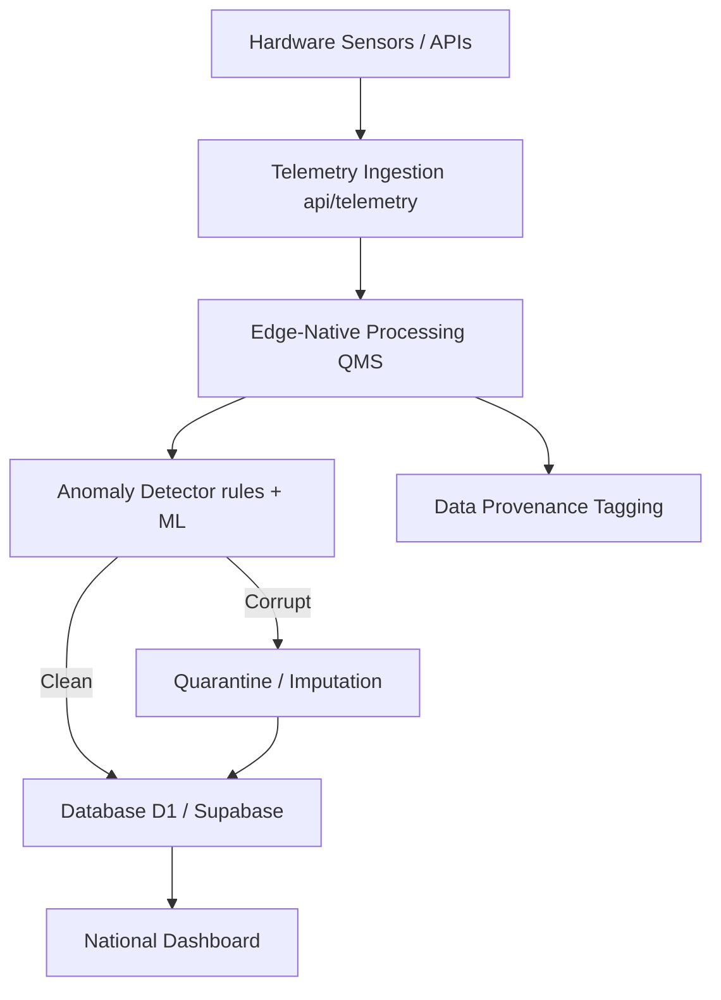

# App Flow & Architecture (MetShield AI)

## 1. High-Level Architecture
MetShield AI acts as a middleware and presentation layer for automated weather station telemetry. It sits between incoming station data and the display/NWP assimilation system. 

## 2. User Journeys & Application Flow

### 2.1 Public Landing (/)
- Explains the mission of the MetShield-QMS platform.
- Links to internal dashboards and regulatory references.
- **Components:** `LandingHero`, `LandingFeatures`, `MissionStatement`.

### 2.2 National Operations Command Dashboard (/dashboard)
- **Role:** Central monitoring for 766 districts and critical AWS nodes.
- **Flow:**
  1. Operator opens `/dashboard`.
  2. Data fetches via `vayuPoller` connecting to backend APIs or real-time simulation.
  3. Interactive Map (React Leaflet) displays AWS nodes in green (nominal) or red (fault).
  4. Real-time telemetry feed streams on the right panel.
  5. Operator clicks a station for deep-dive diagnostics.

### 2.3 Mobile Field Sensor Node (/mobile)
- **Role:** Turns an operator's smartphone into a verified AWS mobile edge node.
- **Flow:**
  1. Technician accesses `/mobile`.
  2. Service Worker registers for offline capabilities (PWA).
  3. Geolocation, Barometric (via Generic Sensor API), and Accelerometer APIs initialize.
  4. Telemetry is packed, hashed, and sent securely via `/api/telemetry`.

### 2.4 Incident Command & Work Orders (/incidents)
- **Role:** Ticketing system for field maintenance.
- **Flow:**
  1. If `FLAG_4_CORRUPT_HARDWARE` trips on a node, a ticket is automatically generated.
  2. Operator views `/incidents` to see pending NABL maintenance dispatches.
  3. Actions available: Escalate, Mark Fixed, Quarantine Node permanently.

### 2.5 Technical Audit Report (/audit-report)
- **Role:** Generates an integrity dossier for external audits (e.g., WMO compliance).
- **Flow:** Renders frozen historical data with integrity digests proving no tampering occurred between ingestion and reporting.

## 3. Real-Time Telemetry Pipeline (The QMS Flow)
1. **Ingest:** Data arrives at `/api/telemetry` or polled via `lib/vayuPoller.ts`.
2. **Evaluate:** `lib/anomalyDetector.ts` applies:
   - Zahumenský physical limits.
   - Thermodynamic Invariant discriminators.
3. **Classify:** Normal (Flag 1), Storm (Flag 2), Drift (Flag 3), Spikes (Flag 4), Loss (Flag 5).
4. **Impute:** If missing or drifting, spatial KNN / WMA recovers it.
5. **Store:** Digested and saved to SQL backend.
6. **Broadcast:** Broadcast channels and WebSockets push the state to connected React clients.
